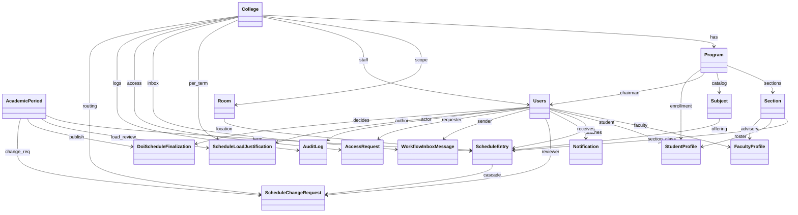

```mermaid
classDiagram

class AcademicPeriod
class College
class Program
class Section
class Subject
class Room
class Users
class FacultyProfile
class StudentProfile
class ScheduleEntry
class ScheduleChangeRequest
class ScheduleLoadJustification
class DoiScheduleFinalization
class Notification
class WorkflowInboxMessage
class AccessRequest
class AuditLog

AcademicPeriod --> ScheduleEntry : term
AcademicPeriod --> ScheduleLoadJustification : load_review
AcademicPeriod --> DoiScheduleFinalization : publish
AcademicPeriod --> ScheduleChangeRequest : change_req

College --> Program : has
College --> Room : scope
College --> Users : staff
College --> ScheduleLoadJustification : per_term
College --> WorkflowInboxMessage : inbox
College --> AccessRequest : access
College --> AuditLog : logs
College --> ScheduleChangeRequest : routing

Program --> Section : sections
Program --> Subject : catalog
Program --> Users : chairman
Program --> StudentProfile : enrollment

Section --> ScheduleEntry : section_class
Section --> StudentProfile : roster
Section --> FacultyProfile : advisory

Users --> FacultyProfile : faculty
Users --> StudentProfile : student
Users --> ScheduleEntry : teaches
Users --> Notification : receives
Users --> ScheduleChangeRequest : reviewer
Users --> WorkflowInboxMessage : sender
Users --> AccessRequest : requester
Users --> AuditLog : actor
Users --> ScheduleLoadJustification : author
Users --> DoiScheduleFinalization : decides

Subject --> ScheduleEntry : offering
Room --> ScheduleEntry : location

ScheduleEntry --> ScheduleChangeRequest : cascade
```
